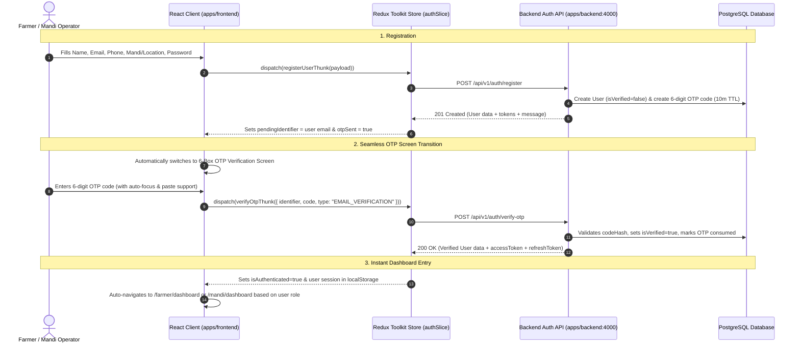

# Frontend Authentication, OTP Verification & Redux Integration Guide

## Overview
This document specifies the complete frontend authentication and OTP verification lifecycle for Agrovia, connecting the React Application (`apps/frontend`) to the Express/Bun backend API (`apps/backend`) using Redux Toolkit.

---

## 1. Complete User Journey (Registration → OTP → Dashboard)



---

## 2. Redux Store Architecture (`apps/frontend/src/store/`)

### State Shape (`auth` slice)
```typescript
interface AuthState {
  user: User | null;
  accessToken: string | null;
  isAuthenticated: boolean;
  isLoading: boolean;
  otpSent: boolean;
  pendingIdentifier: string | null;
  pendingOtpType: "EMAIL_VERIFICATION" | "LOGIN_OTP" | "PASSWORD_RESET";
  error: string | null;
  successMessage: string | null;
}
```

### Async Thunks
- `registerUserThunk`: Dispatches to `POST /api/v1/auth/register` and switches view to `OTP_VERIFY`.
- `sendOtpThunk`: Dispatches to `POST /api/v1/auth/send-otp` with countdown timer.
- `verifyOtpThunk`: Dispatches to `POST /api/v1/auth/verify-otp` and activates session.
- `loginUserThunk`: Dispatches to `POST /api/v1/auth/login`. If unverified (`ACCOUNT_NOT_VERIFIED`), automatically opens `OTP_VERIFY`.
- `fetchCurrentUserThunk`: Auto-hydrates active user session on startup.
- `logout`: Clears session tokens from storage and resets state.

---

## 3. Connected Backend API Endpoints

| Endpoint | Method | Payload | Description |
|---|:---:|---|---|
| `/api/v1/auth/register` | `POST` | `{ name, email, phone, password, role }` | Creates account & sends verification OTP |
| `/api/v1/auth/login` | `POST` | `{ identifier, password }` | Authenticates email/phone + password |
| `/api/v1/auth/send-otp` | `POST` | `{ identifier, type }` | Triggers or resends 6-digit OTP code |
| `/api/v1/auth/verify-otp` | `POST` | `{ identifier, code, type }` | Validates 6-digit OTP and activates account |
| `/api/v1/auth/me` | `GET` | Headers: `Bearer <token>` | Fetches active authenticated user session |

---

## 4. OTP Verification UI Capabilities
1. **6-Box Segmented Inputs**: Auto-advances focus upon typing and supports backspace navigation.
2. **Instant Clipboard Paste**: Automatically splits 6 pasted digits across the inputs and auto-submits.
3. **Resend Timer**: 60-second cooldown timer prevents rate limiting and spam.
4. **Typo Correction**: "Back to Details" link allows correcting email/phone without losing context.
